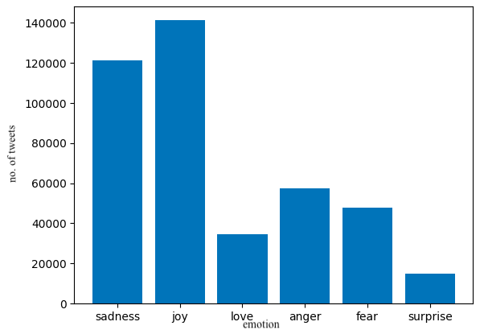
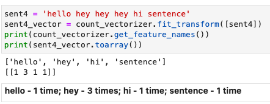
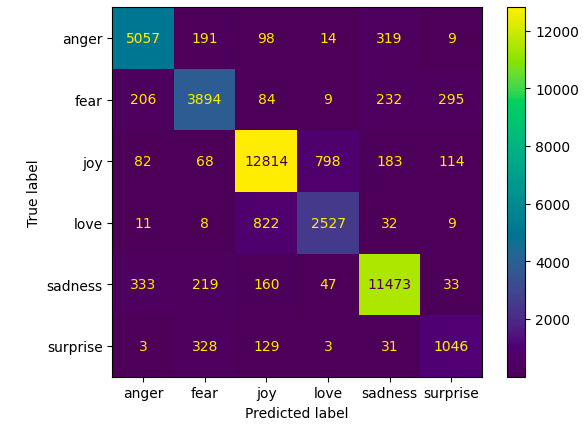

# AI Mini Project - Mood Prediction based on Text

[source code](https://github.com/GodaKartik/AI-MiniProject-Code)

## Overview
User is shown a random image from a directory of images and is asked to express his thoughts in a few sentences. Based on this, the mood of the person is predicted. 

Logistic Regression is used over a dataset containing around 400,000 labelled tweets 

## Process
### Cleaning Data
* clearUsernames - using python's re module to remove tagged usernames from tweets
* removeStopwords - 
    * Stopwords are commonly used words that offer no value to machine learning and generate noise
    * The [NLTK](https://www.nltk.org/) corpus contains language specific stopwords
    * Looped through all the text entries and removed stopwords present in the NLTK English stopwords' list
### Data


### Vectorizing
Machine learning models can not deal with textual data and need some form of numeric inputs. This is called feature extraction (converting raw data (images,text, etc) into numbers)

Vecorizing is a form of feature extraction of textual data into vectors (single or multi dimensional arrays - matrices)

Used [CountVectorizer](https://scikit-learn.org/stable/modules/generated/sklearn.feature_extraction.text.CountVectorizer.html#sklearn.feature_extraction.text.CountVectorizer) from the [scikitlearn](https://scikit-learn.org/) package here. CountVectorizer tokenizes all the text and sorts them into an array of tokens sorted alphabetically. Then, each text entry is represented as an with the number of time the words from the alphabetic array occur in that particular text row.


### Machine Learning
Used logistic regression to train a model which can classify text into emotional categories - joy, sadness, fear, anger, surprise and love

Regression - a technique in statistics to predict a relation between one/more independant variable and an output variable

Logistic Regression - similar to classification based ML models, logistic regression is used to classify input into a given set of categories

Text is split in the ratio 9:1. Usuaully 8:2 is standard but to increase accuracy, used a 9 to 1. Then text is tokeinzed, vectorized, and fitted into a logistic regression model

On testing the model on the test portion of the data, the accuracy is **88.3%**

### Confusion Matrix
* confusion matrix is cisual representation of the accuracy of the classification. Shows the number of times an emotion matches its prediction and the number of times it is falsely classified

* joy and sadness are highly accurate owing to large amount of data belonging to these categories _(refer emotion distribution plot above)_

___
_to test this application, install python, packages from requirements.txt and ```python manage.py runserver``` from the project directory_